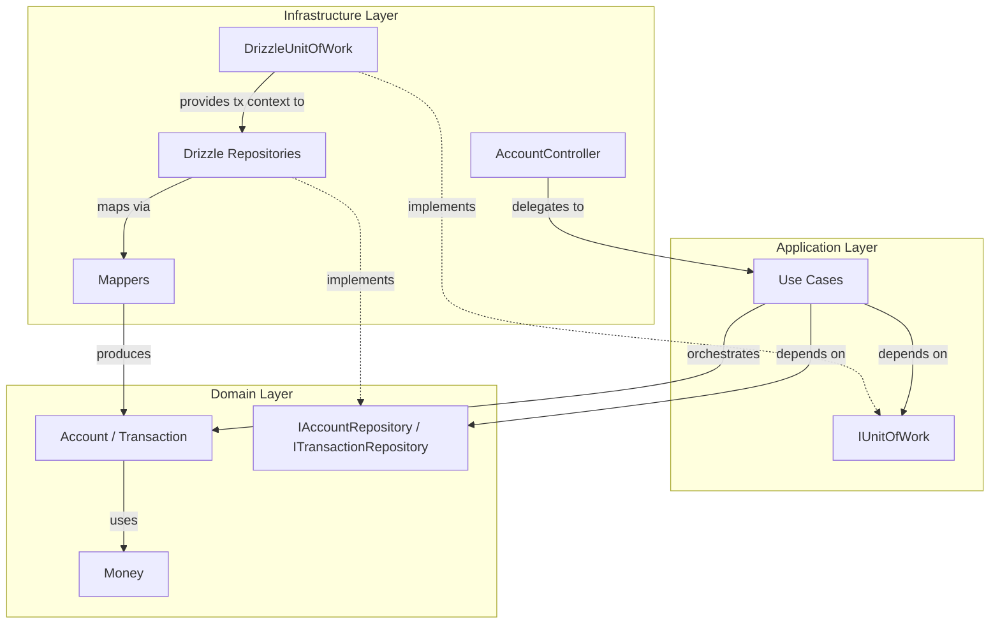
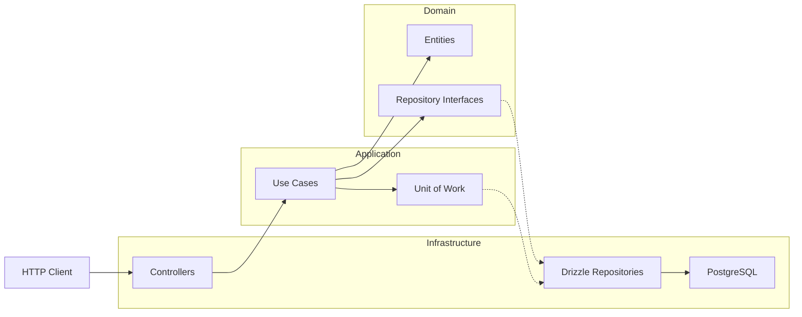
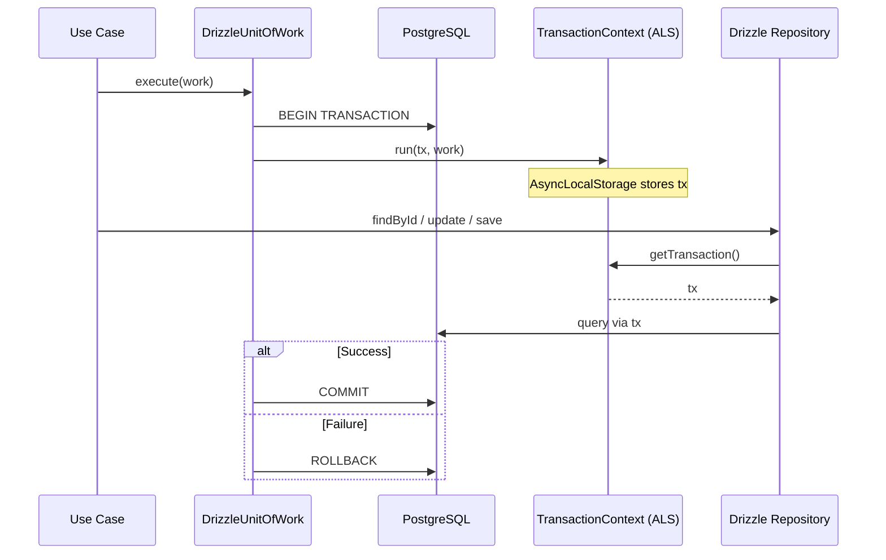
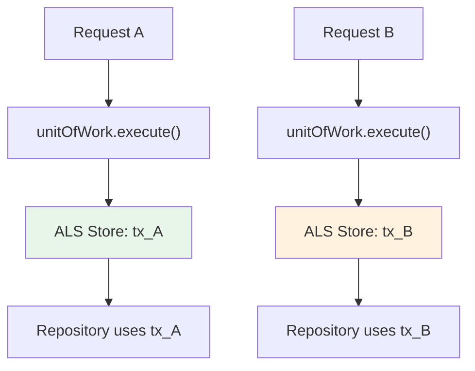

# Ports and Adapters

A backend study project built with NestJS, TypeScript, and Drizzle ORM. It implements a banking domain to demonstrate software architecture principles — not as a generic CRUD exercise, but as a deliberate exploration of **Domain-Driven Design**, **Clean Architecture**, and **Hexagonal Architecture (Ports and Adapters)**.

The application models core banking operations (account lifecycle, deposits, withdrawals, transfers, balance, and statements) while keeping the domain layer fully decoupled from frameworks, databases, and HTTP concerns.

---

## Project Overview

This project exists to practice **backend architecture** and **design discipline**. The banking features serve as a realistic domain with non-trivial business rules — balance invariants, account status constraints, atomic transfers — that justify layered design rather than a flat controller-to-database approach.

Architectural goals:

- Keep business rules inside the **Domain** layer
- Orchestrate workflows through **Use Cases** in the Application layer
- Isolate persistence and HTTP behind **Adapters**
- Manage database transactions transparently via **Unit of Work**
- Wire dependencies through **interfaces** and **Dependency Injection**

---


## Technologies


| Technology         | Role                                             |
| ------------------ | ------------------------------------------------ |
| **NestJS**         | HTTP server, module system, dependency injection |
| **TypeScript**     | Static typing across all layers                  |
| **Drizzle ORM**    | Type-safe SQL access and schema management       |
| **PostgreSQL**     | Relational persistence                           |
| **Docker**         | Container runtime for the database               |
| **Docker Compose** | Local PostgreSQL orchestration                   |
| **Jest**           | Unit testing framework                           |
| **ESLint**         | Static code analysis                             |
| **Prettier**       | Code formatting                                  |


Additional libraries: **BigNumber.js** (monetary precision), **pg** (PostgreSQL driver), **@nestjs/config** (environment configuration).

---


## Architecture

The codebase follows a layered architecture where **dependencies always point inward**. Outer layers depend on inner abstractions — never the reverse.

### Domain Driven Design (DDD)

The domain is modeled around banking concepts:

- **Account** — aggregate root with balance and lifecycle behavior
- **Transaction** — record of financial movements
- **Money** — value object encapsulating monetary amounts and arithmetic

Business invariants (positive amounts, sufficient balance, zero balance before closing) live inside domain entities, not in controllers or repositories.

### Clean Architecture

Layers are separated by responsibility:


| Layer              | Responsibility                                                 |
| ------------------ | -------------------------------------------------------------- |
| **Domain**         | Entities, value objects, business rules, repository interfaces |
| **Application**    | Use cases, input/output contracts, persistence ports           |
| **Infrastructure** | HTTP controllers, ORM, repository implementations, mappers     |


The domain and application layers have **zero knowledge** of NestJS decorators, Drizzle, or PostgreSQL.

### Ports and Adapters (Hexagonal Architecture)

**Ports** are interfaces defined by the core:

- `IAccountRepository`, `ITransactionRepository` (domain ports)
- `IUnitOfWork` (application port)

**Adapters** are infrastructure implementations:

- `DrizzleAccountRepository`, `DrizzleTransactionRepository`
- `DrizzleUnitOfWork`
- `AccountController`

Swapping Drizzle for another persistence mechanism would require changes only in the infrastructure layer.

### Dependency Injection

NestJS resolves dependencies at the module boundary. Repository interfaces and the Unit of Work are bound to concrete implementations via **Symbol tokens** and **factory providers**. Use cases are plain TypeScript classes — framework-agnostic — instantiated through `useFactory`.

### Repository Pattern

Persistence is abstracted behind repository interfaces in the domain. Use cases depend on `IAccountRepository` and `ITransactionRepository`, not on SQL or ORM APIs. Infrastructure provides Drizzle-backed implementations that translate between domain objects and database rows.

### Unit of Work Pattern

Each use case executes its workflow inside `unitOfWork.execute(...)`, ensuring all repository operations within a single business operation share the same database transaction. Commit and rollback are handled automatically by the infrastructure.

### Layer Communication




### Architecture Overview




---


## Folder Structure

```
src/
├── main.ts                          # Application bootstrap
├── app.module.ts                    # Root module
│
├── domain/                          # Core business logic (innermost layer)
│   ├── account/
│   │   ├── account.ts               # Account aggregate
│   │   ├── account-status.type.ts   # Account status enum
│   │   ├── account.repository.ts    # Repository port
│   │   └── account.repository.token.ts
│   ├── transaction/
│   │   ├── transaction.ts           # Transaction entity
│   │   ├── transaction.type.ts      # Transaction type enum
│   │   ├── transaction.repository.ts
│   │   └── transaction.repository.token.ts
│   └── shared/
│       └── money.vo.ts              # Money value object
│
├── application/                     # Application services and ports
│   ├── ports/
│   │   └── persistence/
│   │       ├── unit-of-work.ts      # Unit of Work port
│   │       └── unit-of-work.token.ts
│   └── use-cases/
│       ├── open-account/
│       ├── deposit-money/
│       ├── withdraw-money/
│       ├── transfer-money/
│       ├── get-balance/
│       ├── get-statement/
│       └── close-account/
│
└── infrastructure/                  # External concerns (outermost layer)
    ├── api/
    │   └── account/
    │       ├── account.controller.ts
    │       ├── account.module.ts
    │       └── dto/
    └── persistence/
        └── drizzle/
            ├── drizzle.ts           # Database connection factory
            ├── drizzle.module.ts
            ├── drizzle-unit-of-work.ts
            ├── transaction-context.ts
            ├── schema/
            ├── mappers/
            └── repositories/
```


| Directory                             | Responsibility                                                                                                      |
| ------------------------------------- | ------------------------------------------------------------------------------------------------------------------- |
| `domain/`                             | Entities, value objects, business rules, and repository interfaces. No framework or ORM imports.                    |
| `application/`                        | Use cases that orchestrate domain logic. Defines persistence ports (`IUnitOfWork`). Input/output DTOs per use case. |
| `infrastructure/api/`                 | HTTP controllers and request DTOs. Translates HTTP into use case inputs.                                            |
| `infrastructure/persistence/drizzle/` | Drizzle schema, repository implementations, mappers, transaction context, and Unit of Work.                         |


Each use case folder contains:

```
use-case-name/
├── *.use-case.ts       # Application service
├── *.input.ts          # Input contract
├── *.output.ts         # Output contract
└── *.use-case.spec.ts  # Unit tests
```

---


## Domain


### Entities

**Account** (`domain/account/account.ts`) — rich aggregate root that encapsulates banking behavior:

- Factory method: `Account.open(ownerId)`
- Operations: `deposit()`, `withdraw()`, `close()`, `getBalance()`, `getStatus()`
- Enforces invariants internally (open status, positive amounts, sufficient balance, zero balance to close)

**Transaction** (`domain/transaction/transaction.ts`) — entity representing a financial movement. Holds `id`, `accountId`, `amount`, `type`, `createdAt`, and optional `relatedAccountId` / `description`.

### Value Objects

**Money** (`domain/shared/money.vo.ts`) — immutable value object backed by BigNumber.js:

- Created via `Money.of(string)` — rejects negative values
- Provides `add`, `subtract`, `isGreaterThan`, `isZero`, `isPositive`, `isNegative`, `toString`
- Ensures monetary precision without floating-point errors


### Business Rules

Rules enforced at the domain level:


| Rule                                   | Entity  | Constraint                                      |
| -------------------------------------- | ------- | ----------------------------------------------- |
| Deposit amount must be positive        | Account | Rejects zero and negative amounts               |
| Withdrawal requires sufficient balance | Account | Balance must cover the amount                   |
| Operations require open account        | Account | Closed accounts reject deposits and withdrawals |
| Account closure requires zero balance  | Account | Cannot close with remaining funds               |
| Money cannot be negative               | Money   | Factory rejects negative input                  |


### Repository Interfaces

Defined in the domain as persistence ports:

```typescript
// IAccountRepository
save(account: Account): Promise<Account>
update(account: Account): Promise<Account>
findById(id: string): Promise<Account | null>

// ITransactionRepository
save(transaction: Transaction): Promise<Transaction>
findByAccountId(accountId: string): Promise<Transaction[]>
```

---


## Application Layer


### Use Cases

Each business operation is a dedicated class with a single `execute` method. Use cases are **plain TypeScript classes** — not NestJS injectables — keeping the application layer framework-independent.


| Use Case               | Description                                 |
| ---------------------- | ------------------------------------------- |
| `OpenAccountUseCase`   | Creates a new account for a given owner     |
| `DepositMoneyUseCase`  | Deposits funds and records a transaction    |
| `WithdrawMoneyUseCase` | Withdraws funds and records a transaction   |
| `TransferMoneyUseCase` | Moves funds between two accounts atomically |
| `GetBalanceUseCase`    | Returns the current account balance         |
| `GetStatementUseCase`  | Returns balance and transaction history     |
| `CloseAccountUseCase`  | Closes an account with zero balance         |


Every mutating use case wraps its logic inside `unitOfWork.execute(...)`.

### Input DTOs

Plain TypeScript interfaces defining the use case input contract. Amounts are represented as **strings** to preserve decimal precision before conversion to `Money`.

Example — `TransferMoneyInput`:

```typescript
{ sourceAccountId: string; targetAccountId: string; amount: string }
```


### Output DTOs

Plain TypeScript interfaces returned by use cases. They expose only the data required by the caller — no domain entities leak outward.

Example — `TransferMoneyOutput`:

```typescript
{ transactionOutId: string; transactionInId: string; sourceBalance: string }
```


### Dependency Inversion

Use cases depend on abstractions, not implementations:

```typescript
constructor(
  private readonly accountRepository: IAccountRepository,
  private readonly transactionRepository: ITransactionRepository,
  private readonly unitOfWork: IUnitOfWork,
) {}
```

Concrete Drizzle repositories and the Drizzle Unit of Work are wired at the infrastructure boundary through NestJS factory providers.

---


## Infrastructure


### Controllers

`AccountController` is a thin HTTP adapter. It maps routes to use case invocations without containing business logic.


| Method | Route                            | Use Case      |
| ------ | -------------------------------- | ------------- |
| `POST` | `/accounts`                      | Open Account  |
| `POST` | `/accounts/:accountId/deposit`   | Deposit       |
| `POST` | `/accounts/:accountId/withdraw`  | Withdraw      |
| `POST` | `/accounts/:accountId/transfer`  | Transfer      |
| `GET`  | `/accounts/:accountId/balance`   | Balance       |
| `GET`  | `/accounts/:accountId/statement` | Statement     |
| `POST` | `/accounts/:accountId/close`     | Close Account |


### Drizzle ORM

Schema definitions live in `infrastructure/persistence/drizzle/schema/`:

- **accounts** — `id`, `owner_id`, `balance`, `status`, `created_at`
- **transactions** — `id`, `account_id`, `amount`, `type`, `created_at`, `related_account_id`, `description`

Schema is synchronized via `drizzle-kit push` (see [Getting Started](#getting-started)).

### PostgreSQL

Persistence is backed by PostgreSQL 17, provisioned locally through Docker Compose. Connection is configured via the `DATABASE_URL` environment variable.

### Repository Implementations

- `DrizzleAccountRepository` — implements `IAccountRepository`
- `DrizzleTransactionRepository` — implements `ITransactionRepository`

Both extend `BaseDrizzleRepository`, which resolves the active database connection through `TransactionContext` (see [Unit of Work](#unit-of-work)).

### Mappers

Mappers translate between persistence records and domain objects, keeping ORM types out of the domain:

- `AccountMapper` — `toDomain(row)` / `toPersistence(account)`
- `TransactionMapper` — `toDomain(row)` / `toPersistence(transaction)`

---


## Unit of Work

The Unit of Work ensures that all persistence operations within a single use case execute atomically inside one database transaction.

### Implementation

**Port** — defined in the application layer:

```typescript
interface IUnitOfWork {
  execute<T>(work: () => Promise<T>): Promise<T>;
}
```

**Adapter** — `DrizzleUnitOfWork` opens a Drizzle transaction and stores the transaction handle in `TransactionContext`:

```typescript
async execute<T>(work: () => Promise<T>): Promise<T> {
  return this.db.transaction(async (tx) => {
    return this.transactionContext.run(tx, work);
  });
}
```

**Connection resolution** — `BaseDrizzleRepository` selects the correct connection automatically:

```typescript
protected getConnection() {
  return this.transactionContext.getTransaction() ?? this.db;
}
```


### Behavior

- Every use case executes its workflow inside `unitOfWork.execute(...)`
- `AsyncLocalStorage` maintains the transaction context for the duration of the request
- Repositories call `getConnection()` — when a transaction is active, they receive the `tx` object; otherwise, they use the default Drizzle connection
- If any operation fails, the entire transaction rolls back
- Use cases never receive or pass transaction objects explicitly


### Transaction Flow




---


## Why AsyncLocalStorage?

Passing a transaction object through every repository method would leak infrastructure concerns into use cases and pollute method signatures across the entire persistence layer.

**AsyncLocalStorage** (from Node.js `async_hooks`) provides **implicit, request-scoped context propagation**:

1. `DrizzleUnitOfWork` starts a database transaction and calls `transactionContext.run(tx, work)`
2. `AsyncLocalStorage.run()` stores the `tx` handle in an isolated store bound to the current async execution chain
3. Any repository method invoked within that chain can retrieve the active transaction via `getTransaction()`
4. When no transaction is active, repositories fall back to the default Drizzle connection


### How It Works Internally

`AsyncLocalStorage` associates a value with the current **async context** — the chain of async operations triggered by a single call (e.g., an HTTP request handler). Each concurrent request maintains its own isolated store, preventing transaction handles from leaking across requests.




This approach keeps use cases and repository interfaces clean while guaranteeing transactional consistency without explicit parameter threading.

---


## Testing

Unit tests are implemented with **Jest**. The test suite covers domain logic and application use cases — no integration or end-to-end tests are included.

### Test Coverage


| Area                        | Files                          | Focus                                     |
| --------------------------- | ------------------------------ | ----------------------------------------- |
| **Domain — Value Objects**  | `money.vo.spec.ts`             | Creation, arithmetic, comparisons         |
| **Domain — Entities**       | `account.spec.ts`              | Open, deposit, withdraw, close invariants |
| **Application — Use Cases** | `*.use-case.spec.ts` (7 files) | Happy paths and error scenarios           |


### Testing Strategy

**Mocks** — use case tests instantiate dependencies as plain Jest mock objects implementing the repository and Unit of Work interfaces. No database or NestJS container is required.

**Repository mocking** — `IAccountRepository` and `ITransactionRepository` are mocked with `jest.fn()` implementations. Tests verify that use cases invoke the correct repository methods with expected arguments.

**Unit of Work mocking** — the UoW mock simply executes the callback, isolating use case logic from transaction management:

```typescript
unitOfWork = {
  execute: jest.fn(async (work) => work()),
};
```

**Business rule testing** — domain entity tests validate invariants directly (insufficient balance, closed account operations, zero-balance closure) without any infrastructure dependencies.

Run the test suite:

```bash
npm test
```

---


## Design Decisions


| Decision                                           | Rationale                                                                                                                        |
| -------------------------------------------------- | -------------------------------------------------------------------------------------------------------------------------------- |
| Repository interfaces live in the **Domain** layer | Persistence is a domain concern expressed as a port; the domain defines what it needs without knowing how it is stored           |
| Implementations live in **Infrastructure**         | Drizzle, SQL, and mapping logic are adapter details that must not leak inward                                                    |
| Use cases do not know about the database           | Use cases depend on `IAccountRepository`, `ITransactionRepository`, and `IUnitOfWork` — never on Drizzle or PostgreSQL           |
| Controllers only orchestrate calls                 | HTTP adapters translate requests into use case inputs and return outputs — no business logic                                     |
| Dependencies are inverted through interfaces       | High-level modules (use cases) depend on abstractions; low-level modules (repositories) implement them                           |
| No ORM inside the Domain                           | Domain entities and value objects are pure TypeScript — no Drizzle decorators, no database annotations                           |
| Use cases are plain classes                        | Framework independence allows direct instantiation in tests without a NestJS testing module                                      |
| Factory providers for wiring                       | NestJS `useFactory` constructs use cases and repositories, binding interfaces to concrete implementations at the module boundary |
| Amounts as strings                                 | Preserves decimal precision across HTTP boundaries before conversion to the `Money` value object                                 |
| AsyncLocalStorage for transaction propagation      | Avoids threading transaction objects through every method while maintaining atomic operations                                    |


---


## Features


| Feature           | Endpoint                             | Description                                                                                      |
| ----------------- | ------------------------------------ | ------------------------------------------------------------------------------------------------ |
| **Open Account**  | `POST /accounts`                     | Creates a new account for a given owner with zero balance                                        |
| **Deposit**       | `POST /accounts/:accountId/deposit`  | Adds funds to an open account and records a deposit transaction                                  |
| **Withdraw**      | `POST /accounts/:accountId/withdraw` | Removes funds from an open account with sufficient balance                                       |
| **Transfer**      | `POST /accounts/:accountId/transfer` | Atomically moves funds between two accounts, recording transfer-out and transfer-in transactions |
| **Statement**     | `GET /accounts/:accountId/statement` | Returns the current balance and full transaction history                                         |
| **Balance**       | `GET /accounts/:accountId/balance`   | Returns the current account balance                                                              |
| **Close Account** | `POST /accounts/:accountId/close`    | Closes an account — requires zero balance and open status                                        |


---


## What I Learned

This project consolidated practical experience across backend architecture and engineering practices:

- **Domain Driven Design** — modeling a domain with aggregates, entities, value objects, and invariants
- **Clean Architecture** — structuring code in concentric layers with strict dependency rules
- **Hexagonal Architecture** — defining ports in the core and implementing adapters at the edges
- **Repository Pattern** — abstracting persistence behind interfaces owned by the domain
- **Unit of Work** — coordinating atomic persistence operations across multiple repositories
- **AsyncLocalStorage** — propagating transaction context implicitly across async call chains
- **Dependency Injection** — composing objects through constructor injection and interface contracts
- **NestJS Providers** — module-based dependency registration and lifecycle management
- **Factory Providers** — constructing framework-agnostic use cases with explicit dependency wiring
- **Transaction Management** — ensuring data consistency without leaking transaction objects into business logic
- **Drizzle ORM** — type-safe schema definition, query building, and transaction APIs
- **Jest** — structuring unit tests with mocks, spies, and isolated test suites
- **Unit Testing** — testing domain rules and use case orchestration without infrastructure
- **SOLID** — applying Single Responsibility, Open/Closed, and Dependency Inversion throughout
- **Dependency Inversion** — depending on abstractions at every layer boundary

---


## Getting Started


### Prerequisites

- Node.js
- Docker and Docker Compose


### Setup

**1. Start PostgreSQL**

```bash
docker compose up -d
```

**2. Configure environment**

```bash
cp .env.example .env
```

**3. Push the database schema**

```bash
npx drizzle-kit push
```

**4. Install dependencies and run**

```bash
npm install
npm run start:dev
```

The server starts on port `3000` by default (`PORT` environment variable overrides).

### Scripts


| Command             | Description             |
| ------------------- | ----------------------- |
| `npm run start:dev` | Start in watch mode     |
| `npm run build`     | Compile TypeScript      |
| `npm run lint`      | Run ESLint              |
| `npm run format`    | Run Prettier            |
| `npm test`          | Run unit tests          |
| `npm run test:cov`  | Run tests with coverage |


